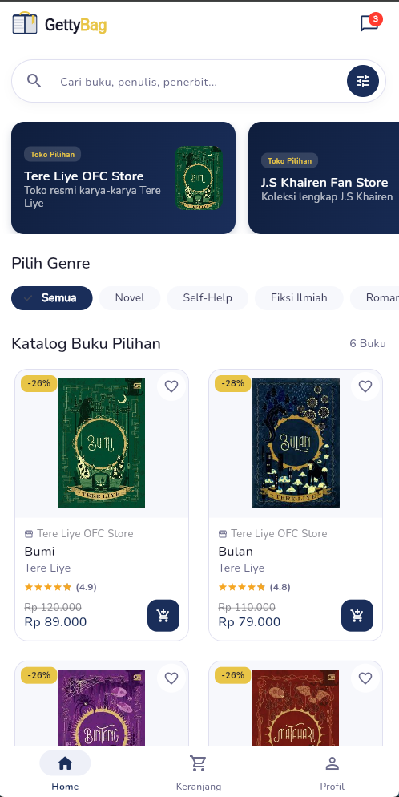
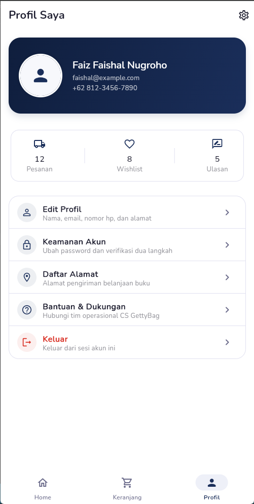
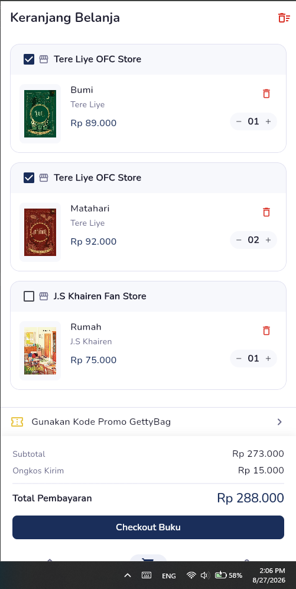
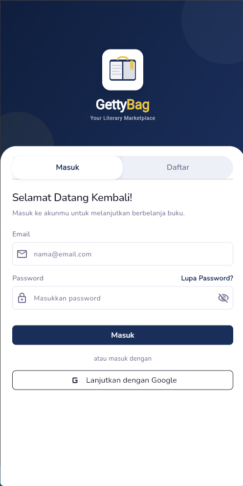

# 📚 GettyBag - Books E-Commerce

GettyBag is a modern, responsive **Flutter UI-Only project** designed for an online bookstore application. Built with scalability in mind, this project includes reusable UI components, clean layouts, and essential e-commerce screens to serve as a solid foundation for full-stack integration.

## ✨ Features & Screens

- **Brand Identity:** Custom Branding Logo & Animated Splash Screen
- **Authentication:** Login & Sign Up Pages
- **Discovery:** Home Page with curated book categories and rating bars
- **Shopping Experience:** Interactive Cart Page & Smooth Navigation Bar
- **User Hub:** Profile Page & Real-time Chat Interface Preview

---

## 🛠️ Packages & Dependencies
```yaml
dependencies:
  flutter:
    sdk: flutter

  # UI Elements & Icons
  cupertino_icons: ^1.0.8
  curved_navigation_bar: ^1.0.6
  clippy_flutter: ^2.0.0-nullsafety.1
  flutter_rating_bar: ^4.0.1
  badges: ^3.1.2
  smooth_page_indicator: ^3.0.0

  # Typography
  google_fonts: ^8.2.1
```

## UI Screenshots

Below are the UI design screenshots of the app:







*All images are UI mockups and not functional implementations.*
## 🚀 Getting Started

Follow these instructions to get a local copy of the project up and running for development and testing.

### Prerequisites

Ensure you have installed the necessary software before proceeding:

* **Flutter SDK**: `^3.0.0` or higher ([Installation Guide](https://docs.flutter.dev/get-started/install))
* **Dart SDK**: Included with Flutter
* **IDE**: [VS Code](https://code.visualstudio.com/) or [Android Studio](https://developer.android.com/studio) with Flutter/Dart plugins installed
* **Git**: Installed and configured on your system

---

### Installation & Setup

1. **Clone the Repository**
   ```bash
   git clone https://github.com/FaishalFaiz/gettybag-ecommerce-app
   cd gettybag-ecommerce-app
   ```

2. **Install Dependencies**
   Fetch all required packages listed in `pubspec.yaml`:
   ```bash
   flutter pub get
   ```

3. **Verify Flutter Environment**
   Run the diagnostic tool to check for missing dependencies:
   ```bash
   flutter doctor
   ```

4. **Run the Application**
   Launch the project on an available emulator, simulator, or connected device:
   ```bash
   # Run on default connected device
   flutter run

   # Run on Chrome for Web testing
   flutter run -d chrome
   ```
